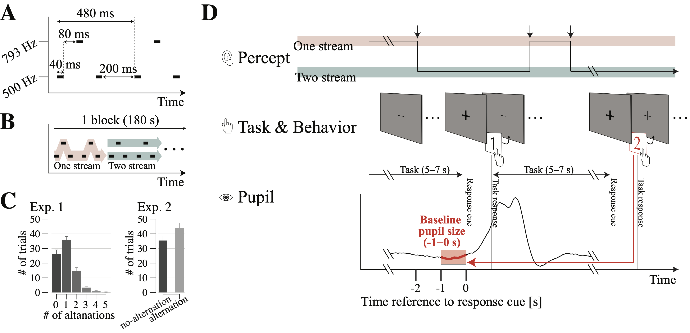

## Article information

Temporal dynamics of auditory bistable perception correlated with a fluctuation of baseline pupil size

Yuta Suzuki, Hsin-I Liao, Shigeto Furukawa

NTT Communication Science Laboratories, NTT Corporation, Atsugi 243-0198, Japan

*Corresponding author: Yuta Suzuki
NTT Communication Science Laboratories, NTT Corporation, Atsugi 243-0198, Japan
Tel: +81-046-240-3525, 
E-mail: yuuta.suzuki.fc@hco.ntt.co.jp


```{r child="readFunc.Rmd"}
```

## Figure 1
```{r, echo=FALSE, out.width = '100%'}

```

Fig. 1. Experimental design. (A) Time configuration of the ABA_ pattern. (B) Consecutive auditory tone sequences which can produce two different patterns of a single galloping or two isolated rhythms. (C) Averaged trial numbers among responses in Experiments 1 and 2 (D) Participants listened to a series of two tones with different frequencies (see ‘Methods’). Participants were asked to count the number of perceptual alternations in Experiment 1 (i.e., number of black arrows in top panel; the trace here is an example for explanation purposes) or report whether they experienced a perceptual alternation in Experiment 2 while a narrow fixation cross was presented. Once the fixation cross became thicker (i.e., response cue), participants pressed a corresponding button depending on the task (i.e., number keys from 0 to 5 in Experiment 1 and yes/no in Experiment 2). All pupil changes illustrated here are averaged data across participants and alternation cases from Experiment 1. To avoid the effect of the motor responses (i.e., button press) or its preparation on the pupil size, the baseline pupil size was defined as the mean pupil size over -1000 to 0 ms to the response cue onset (period marked in red in the graph), and was labeled according to the subsequent participants’ task answer (the red line with arrows) for subsequent baseline pupil size and cross-correlation analysis. 

## figure 2
```{r, message=FALSE, echo=FALSE,warning=FALSE,include=FALSE}

countFigNum = 1

#### Figure 1A ####
load("./data/Exp1/figure2.rda")

numOfsub = length(unique(data_res_tonic$sub))

data_res_tonic$sub = subName[data_res_tonic$sub]
data_res_tonic$data_y = data_res_tonic$Size
data_res_tonic$Size = NULL

config = list(alpha = 0.4,
              stride = 0.1,
              label_x = "# of switch",
              label_y = "Baseline Pupil size  \n [z-scored]",
              title = "Tertile",
              grCol = c("#F8766D","#00BA38","#619CFF")
)
anovakun(data_res_tonic,"sA",long=T, peta=T)
# sigPair = makeSigPair(forDrawingPost)

p = dispLineGraph(data_res_tonic,config,c("numOfSwitch"))

config$ylim = round(seq(-0.3,0.4,0.1),2)
config$ylim_stride = 0.1
config$xlim = round(seq(1,3,1),2)
config$xlim_stride = 0.5

p = setEmptyStyle(p,config)

# p <- drawSignificance(p,sigPair,0.4,0.05,nsFlag)

eval(parse(text=paste("p", countFigNum ,"=p", sep="")))
countFigNum = countFigNum+1

# #### Figure 1B #### 
data = fromJSON(file="../[Python]PreProcessing/Exp1/data/data_tertile.json")

data_tertile = data.frame(
  sub = data$sub,
  data_y = data$numOfSwitch_sorted,
  Tertile = data$tertile
)

data_tertile = aggregate( . ~ sub*Tertile, data = data_tertile, FUN = "mean")

data_tertile$sub = subName[data_tertile$sub]

config = list(
  alpha = 0.4,
  stride = 0.1,
  label_x = "Pupil response bin",
  label_y = "Averaged # of switch",
  title = "Tertile",
  grCol = rep("#BEBEBE",5)
)

x = as.numeric(data_tertile$Tertile)
y = data_tertile$data_y
f <- y ~  a*x + b
model1 <- nls(f, start = c(a = 0, b = 0))

f <- y ~  a*x^2 + b*x + c
model2 <- nls(f, start = c(a = 0, b = 0, c=0))

if (AIC(model1) > AIC(model2)){
  model = model2
}else{
  model = model1
}

df <- data.frame(x = seq(1, 5, length = 10))
data_curve = data.frame(
  x = df$x,
  yy = predict(model, df)
)

anovaData = data_tertile
anovaData$Size_sorted = NULL
# anovakun(anovaData,"sA",long=T, peta=T)
# sigPair = makeSigPair(forDrawingPost)
p <- dispLineGraph(data_tertile,config,c("Tertile"))+
  geom_line(data = data_curve,aes(x=x,y=yy),color='gray')+
  ggtitle("Normalized Baseline pupil size")+
  theme(
    axis.text.y.right = element_text(color = "#F8766D"),
    axis.line.y.right = element_line(color = "#F8766D"),
    axis.ticks.y.right = element_line(color = "#F8766D"),
    axis.title.y.right = element_text(color = "#F8766D")
  )

config$ylim = round(seq(0.7,1.3,0.1),2)
config$ylim_stride = 0.05
config$xlim = round(seq(1,5,1),2)
config$xlim_stride = 0.5

p = setEmptyStyle(p,config)

eval(parse(text=paste("p", countFigNum ,"=p", sep="")))
countFigNum = countFigNum+1

# #### Figure 1C(heatmap) #### 
# # data=fromJSON(file="./data/Exp1/corr.json")
# # melted_data <- melt(data)
# # p_values=fromJSON(file="./data/Exp1/p_values.json")
# # melted_p_values <- melt(p_values)
# 
# melted_data$p.value = melted_p_values$value
# 
# melted_data$value = round(melted_data$value,3)
# 
# melted_data$sig = melted_data$value
# melted_data[melted_data$sig == 0,]$sig=''
# melted_data[melted_data$p.value < 0.05,]$sig = paste(melted_data[melted_data$p.value < 0.05,]$value,'\n*',sep = "")
# melted_data[melted_data$p.value < 0.01,]$sig = paste(melted_data[melted_data$p.value < 0.01,]$value,'\n**',sep = "")
# melted_data[melted_data$p.value < 0.001,]$sig = paste(melted_data[melted_data$p.value < 0.001,]$value,'\n***',sep = "")
# 
# mmName = unique(melted_data$L1)
# melted_data$L1 <- factor(melted_data$L1,levels = mmName)
# melted_data$L2 <- factor(melted_data$L2,levels = rev(mmName))
# 
# melted_data = melted_data[melted_data$value != 0,]
# p = ggplot(data = melted_data, aes(L2, L1, fill = value))+
#   geom_tile(color = "white")+
#   scale_fill_gradient2(low = "#3C50BA", high = "#A6232D", mid = "white",
#                        midpoint = 0, limit = c(-1,1), space = "Lab",
#                        name="Pearson\nCorrelation") +
#   theme_minimal()+
#   theme(axis.text.x = element_text(angle = 45, vjust = 1,
#                                    size = 12, hjust = 1))+
#   theme(axis.text.y = element_text(angle = 45, vjust = 1,
#                                    size = 12, hjust = 1))+
#   coord_fixed()+
#   xlab('')+ylab('')+
#   geom_text(aes(label = sig), color = "black", size = 7,family='Times')+
#   scale_x_discrete(labels = c('numOfSwitch'='# of switch',
#                               'Baseline'='Baseline pupil size',
#                               'numOfBlink'='# of blinks',
#                               'Transient'='Transient pupil change',
#                               'ampOfmSaccade'='Micro-saccade amp.',
#                               'numOfmSaccade'='# of micro-saccade'))+
#   scale_y_discrete(labels = c('numOfSwitch'='# of switch',
#                               'Baseline'='Baseline pupil size',
#                               'numOfBlink'='# of blinks',
#                               'Transient'='Transient pupil change',
#                               'ampOfmSaccade'='Micro-saccade amp.',
#                               'numOfmSaccade'='# of micro-saccade'))
# size_font=20
# p<- p +theme(
#   legend.position = c(1,1),
#   legend.justification = c(1,1),
#   panel.grid = element_blank(),
#   axis.line = element_line(colour="black"),
#   axis.title.x = element_text(size=size_font),
#   axis.title.y = element_text(size=size_font),
#   axis.text.x = element_text(colour="black"),
#   axis.text.y = element_text(colour="black"),
#   axis.ticks = element_line(colour = "black",size = 0.5),
#   text = element_text(size = size_font,family = "Times"),
#   legend.title = element_text(size=(size_font/2)),
#   legend.text = element_text(size=(size_font/2)),
#   plot.title = element_text(size = size_font)
# )
# 
# eval(parse(text=paste("p", countFigNum ,"=p", sep="")))
# countFigNum = countFigNum+1

#### plot #### 
# p = combineGraphs(seq(1,countFigNum-1),'p',NULL)
# # plot(p)
# width_fig=10
# height_fig=10
# CairoFonts(regular = "Times","Times")
# CairoPDF(file="./figure/fig2",
#          width=width_fig, height=height_fig)
# print(p)
# dev.off()

# width_fig=4
# height_fig=4
# CairoFonts(regular = "Times","Times")
# CairoPDF(file="./figure/Figure2A",
#          width=width_fig, height=height_fig)
# print(p1)
# dev.off()
# 
# width_fig=5
# height_fig=5
# CairoFonts(regular = "Times","Times")
# CairoPDF(file="./figure/Figure2B",
#          width=width_fig, height=height_fig)
# print(p2)
# dev.off()
# 
# width_fig=10
# height_fig=10
# CairoFonts(regular = "Times","Times")
# CairoPDF(file="./figure/Figure2C",
#          width=width_fig, height=height_fig)
# print(p3)
# dev.off()

```
```{r, message=FALSE, echo=FALSE, warning=FALSE,fig.width = 10, fig.height = 5}
p = combineGraphs(seq(1,countFigNum-1),'p',NULL)
plot(p)
# width_fig=5
# height_fig=5
# CairoFonts(regular = "Times","Times")
# CairoPDF(file="./figure/Fig2A",
#          width=width_fig, height=height_fig)
# print(p1)
# dev.off()
# width_fig=5
# height_fig=5
# CairoFonts(regular = "Times","Times")
# CairoPDF(file="./figure/Fig2B",
#          width=width_fig, height=height_fig)
# print(p2)
# dev.off()
```

Fig. 2. Baseline pupil size in the number of perceptual alternations. (A) Averaged baseline pupil size from -1000 ms to the response cue onset (see ‘Methods’). (B) Relationship between baseline pupil size and number of perceptual alternations classified by equal size bins. Asterisks (*) indicate statistical significance at *p<0.05, and **p<0.01. Error bars indicate the standard error of the mean.

## figure 3
```{r, message=FALSE, echo=FALSE, warning=FALSE,include=FALSE}

countFigNum=1
go1 = c("unswitch","switch")

FONT_SIZE = 18

#### Figure4A(response) ####
load("./data/Exp2/figure3.rda")
data_res$Responses = go1[data_res$Responses+1]
data_res$Responses = factor(data_res$Responses,levels = go1)

data_res = data_res[,c(1,2,4,3)]
config = list(
  alpha = 0.4,
  stride = 0.1,
  label_x = "",
  label_y = "Pupil size[z-score]",
  title = "Tertile"
)

data_res = data_res[data_res$type == 'size',]
data_res$type = NULL

data_res$sub = subName[data_res$sub]
p <- dispLineGraph(data_res,config,c("Responses"))

config$ylim = round(seq(-0.3,0.1,0.1),2)
config$ylim_stride = 0.05
config$xlim = round(seq(1,2,1),2)
config$xlim_stride = 0.5

p = setEmptyStyle(p,config)

p <- p + theme(
  legend.position = 'none'
)
eval(parse(text=paste("p", countFigNum ,"=p", sep="")))
countFigNum = countFigNum+1

# #### Figure4B(Tertile) #####
data_tertile=fromJSON(file="./data/Exp2/data_tertile20210610.json")
data_tertile = data.frame(
  sub = data_tertile$sub,
  Tertile = data_tertile$tertile,
  responses_sorted = data_tertile$responses_sorted,
  data_y = data_tertile$responses_sorted
)
data_tertile = aggregate( . ~ sub*Tertile, data = data_tertile, FUN = "mean")

data_tertile$sub = subName[data_tertile$sub]

config = list(
  alpha = 0.4,
  stride = 0.1,
  label_x = "Pupil response bin",
  label_y = "Averaged # of switch",
  title = "Tertile"
)
x = as.numeric(data_tertile$Tertile)
y = data_tertile$responses_sorted
f <- y ~  a*x + b
model1 <- nls(f, start = c(a = 0, b = 0))

f <- y ~  a*x^2 + b*x + c
model2 <- nls(f, start = c(a = 0, b = 0, c=0))

if (AIC(model1) > AIC(model2)){
  model = model2
}else{
  model = model1
}

df <- data.frame(x = seq(1, 5, length = 10))
data_curve = data.frame(
  x = df$x,
  yy = predict(model, df)
)

data_tertile$Size_sorted = NULL
anovaData = data_tertile
# anovakun(anovaData,"sA",long=T, peta=T)
# sigPair = makeSigPair(forDrawingPost)
data_tertile$data_y = data_tertile$responses_sorted
data_tertile$responses_sorted = NULL

p <- dispLineGraph(data_tertile,config,c("Tertile"))+
  geom_line(data = data_curve,aes(x=x,y=yy),color='gray')
# ggtitle("Normalized Baseline pupil size")+
#  theme(
#   axis.text.y.right = element_text(color = "#F8766D"),
#   axis.line.y.right = element_line(color = "#F8766D"),
#   axis.ticks.y.right = element_line(color = "#F8766D"),
#   axis.title.y.right = element_text(color = "#F8766D")
# )
config$ylim = round(seq(-0.15,0.15,0.05),4)
config$ylim_stride = 0.02
config$xlim = round(seq(1,5,1),2)
config$xlim_stride = 0.5

p = setEmptyStyle(p,config)

# # p <- drawSignificance(p,sigPair,1.25,0.03,nsFlag)
eval(parse(text=paste("p", countFigNum ,"=p", sep="")))
countFigNum = countFigNum+1
```

```{r, message=FALSE, echo=FALSE, warning=FALSE, fig.width = 10, fig.height = 5}
p = combineGraphs(seq(1,countFigNum-1),'p',NULL)
plot(p)

# width_fig=5
# height_fig=5
# CairoFonts(regular = "Times","Times")
# CairoPDF(file="./figure/Fig3A",
#          width=width_fig, height=height_fig)
# print(p1)
# dev.off()
# width_fig=5
# height_fig=5
# CairoFonts(regular = "Times","Times")
# CairoPDF(file="./figure/Fig3B",
#          width=width_fig, height=height_fig)
# print(p2)
# dev.off()
```

Fig. 3. Results of Experiment 2. (A) Averaged baseline pupil size from -1000 ms to the response cue onset (see ‘Methods’). (B) Relationship between baseline pupil size and probability of perceptual alternation classified by equal size bins. The asterisk (*) indicates statistical significance at p < 0.05. Error bars indicate the standard error of the mean.

## figure 4
```{r, message=FALSE, echo=FALSE, warning=FALSE,include=FALSE}

g2 = c('unswitch','switch')
countFigNum = 1

#### data loading ------------------------------------------------------------
data=fromJSON(file="../[Python]PreProcessing/Exp1/data/PDPCevents.json")

dat <- list(matrix(unlist(data$constriction),nrow=length(data$constriction),byrow=T),
            matrix(unlist(data$dilation),nrow=length(data$dilation),byrow=T))

indices = NULL
events = NULL
sub = NULL
numOfSwitch = NULL
numOfTrial = NULL

for(i in 1:length(data$event)){
  indices = rbind(indices, matrix(data[["indices"]][[i]])-4000 )
  events = rbind(events, matrix(data[["event"]][[i]]))
  sub = rbind(sub,matrix(rep(data$sub[i],length(data[["indices"]][[i]]))))
  numOfSwitch = rbind(numOfSwitch,matrix(rep(data$numOfSwitch[i],length(data[["indices"]][[i]]))))
  # numOfTrial = rbind(numOfTrial,matrix(rep(i,length(data[["indices"]][[i]]))))
  numOfTrial = rbind(numOfTrial,matrix(rep(data$numOfTrial[i],length(data[["indices"]][[i]]))))
}

# data$numOfTrial[i]
g1 = c('constriction','dilation')
g2 = c('0','1','2+')
# g2 = c('0','1')
g3 = c('unswitch','switch','switch')

ind_data_e1_raster = data.frame(
  sub = sub,
  numOfSwitch = numOfSwitch,
  indices = indices,
  events = g1[events+1],
  numOfTrial = numOfTrial,
  exp = 'Exp1'
)
ind_data_e1_raster[ind_data_e1_raster$numOfSwitch > length(g2)-2,]$numOfSwitch = length(g2)-1
ind_data_e1_raster$numOfSwitch = g2[ind_data_e1_raster$numOfSwitch+1]

ind_data_e1 = data.frame(
  sub = rep(data$sub,2),
  numOfSwitch = rep(data$numOfSwitch,2),
  data_y = c(data$dilation_time,data$constriction_time),
  events = rep(c('dilation','constriction'),times=c(length(data$sub),length(data$sub))),
  exp = 'Exp1'
)

ind_data_e1[ind_data_e1$numOfSwitch > length(g2)-2,]$numOfSwitch = length(g2)-1
numOfSub_e1 = length(unique(ind_data_e1$sub))

#### Exp2
data=fromJSON(file="../[Python]PreProcessing/Exp2/data/PDPCevents.json")

dat <- list(matrix(unlist(data$constriction),nrow=length(data$constriction),byrow=T),
            matrix(unlist(data$dilation),nrow=length(data$dilation),byrow=T))

indices = NULL
events = NULL
sub = NULL
responses = NULL
numOfTrial = NULL
for(i in 1:length(data$event)){
  if (length(data[["indices"]][[i]]) != 0){
    indices = rbind(indices, matrix(data[["indices"]][[i]])-4000 )
    events = rbind(events, matrix(data[["event"]][[i]]))
    sub = rbind(sub,matrix(rep(data$sub[i],length(data[["indices"]][[i]]))))
    responses = rbind(responses,matrix(rep(data$responses[i],length(data[["indices"]][[i]]))))
    numOfTrial = rbind(numOfTrial,matrix(rep(data$numOfTrial[i],length(data[["indices"]][[i]]))))
  }
}

ind_data_e2_raster = data.frame(
  sub = sub,
  numOfSwitch = responses,
  indices = indices,
  events = g1[events+1],
  numOfTrial = numOfTrial,
  exp = 'Exp2'
)

ind_data_e2 = data.frame(
  sub = rep(data$sub,2),
  numOfSwitch = rep(data$responses,2),
  data_y = c(data$dilation_time,data$constriction_time),
  events = rep(c('dilation','constriction'),times=c(length(data$sub),length(data$sub))),
  exp = 'Exp2'
)
numOfSub_e2 = length(unique(ind_data_e2$sub))

# ####### Figure 5A(raster) #####
ind_data_raster = rbind(ind_data_e1_raster,ind_data_e2_raster)

p = ggplot(ind_data_raster,aes(x = indices, y = numOfTrial,group=events,color=events))+
  geom_point(shape=16,alpha=0.4,size=1)+
  scale_color_manual(values = c('gray80','black'))+
  facet_grid(numOfSwitch ~ exp )

config = list(alpha = 0.4,
              stride = 0.1,
              label_x = "",
              label_y = "# of PD events",
              title = "")

config$ylim = round(seq(0,2000,500),2)
config$ylim_stride = 100
config$xlim = round(seq(-2000,4000,1000),2)
config$xlim_stride = 100

p = setEmptyStyle(p,config)
p = p +
  scale_x_continuous(breaks=round(seq(-4000,4000,1000),2),labels=round(seq(-4,4,1),2))+
  xlab('Time[sec]')+ ylab('# trial')+
  coord_cartesian(xlim=c(-2100,4000),expand=FALSE)

eval(parse(text=paste("p", countFigNum ,"=p", sep="")))
countFigNum = countFigNum+1

# ## average -----------------------------------------------------------------
ind_data = rbind(ind_data_e1,ind_data_e2)
ind_data$numOfSwitch = g3[as.integer(ind_data$numOfSwitch)+1]

ind_data = ind_data[,c(1,2,4,5,3)]
ind_data$numOfSwitch = factor(ind_data$numOfSwitch,c('unswitch','switch'))

# data_PD = aggregate( data_y ~ sub*numOfSwitch, data = ind_data[ind_data$events == 'dilation',], FUN = "mean")
# data_PC = aggregate( data_y ~ sub*numOfSwitch, data = ind_data[ind_data$events == 'constriction',], FUN = "mean")

# # config = list(alpha = 0.4,
# #               stride = 0.1,
# #               label_x = "",
# #               label_y = "# of pupil dailation events",
# #               title = "")
# # 
# # p = dispLineGraph(data_ave,config,c("numOfSwitch"))
# # p = setEmptyStyle(p)
# # p = p +
# #   scale_y_continuous(breaks=round(seq(2.1,2.4,0.1),2))+
# #   # scale_x_continuous(breaks=round(seq(0.5,1),2))+
# #   ylab('Normalized frequency')+
# #   coord_cartesian(xlim=c(0.5,2.5),ylim=c(2.05,2.5),expand=FALSE)+
# #   annotate(x=1, xend=2, y=2.05, yend=2.05, colour="black", lwd=0.5, geom="segment")+
# #   annotate(x=0.5, xend=0.5, y=2.1, yend=2.4, colour="black", lwd=0.5, geom="segment")+
# #   theme(
# #     axis.ticks = element_line(colour = "black",size = 0.5)
# #   )
# 
# 
# ####### Figure 5B(average) ####### 
data_anovaPD = aggregate( data_y ~ sub*numOfSwitch*exp, data = ind_data[ind_data$events == 'dilation',], FUN = "mean")
data_anovaPC = aggregate( data_y ~ sub*numOfSwitch*exp, data = ind_data[ind_data$events == 'constriction',], FUN = "mean")

# t = data_anova[data_anova$exp == 'Exp1',]
# t$exp = NULL
# anovakun(t,"sA",long=T, peta=T)
# 
# t = data_anova[data_anova$exp == 'Exp2',]
# t$exp = NULL
# anovakun(t,"sA",long=T, peta=T)

reject = NULL
for(iSub in unique(data_anovaPD$sub)){
  if(dim(data_anovaPD[data_anovaPD$sub == iSub,])[1] != 4){
    reject = rbind(reject,iSub)
  }
}
for(iSub in reject){
  data_anovaPD = data_anovaPD[data_anovaPD$sub != iSub,]
  data_anovaPC = data_anovaPC[data_anovaPC$sub != iSub,]
}

anovakun(data_anovaPD,"sAB",long=T, peta=T)
anovakun(data_anovaPC,"sAB",long=T, peta=T)

p = dispLineGraph(data_anovaPD,config,c("exp","numOfSwitch"))+
  facet_grid(. ~ exp )

config$ylim = round(seq(1.7,2.1,0.1),2)
config$ylim_stride = 0.05
config$xlim = round(seq(1,2,1),2)
config$xlim_stride = 0.5

p = setEmptyStyle(p,config)

eval(parse(text=paste("p", countFigNum ,"=p", sep="")))
countFigNum = countFigNum+1

# save(data_anovaPD,data_anovaPC,
#      file = "./data/dataset_figure5.rda")
```

```{r, message=FALSE, echo=FALSE, warning=FALSE,fig.width = 10, fig.height = 5}
# ###### plot ###### 
p = combineGraphs(seq(1,countFigNum-1),'p',NULL)
plot(p)
# width_fig=10
# height_fig=15
# CairoFonts(regular = "Times","Times")
# CairoPDF(file="./figure/Figure4A",
#          width=width_fig, height=height_fig)
# print(p1)
# dev.off()
# 
# width_fig=5
# height_fig=5
# CairoFonts(regular = "Times","Times")
# CairoPDF(file="./figure/Figure4B",
#          width=width_fig, height=height_fig)
# print(p2)
# dev.off()
```

Fig. 4. Pupil dilation/constriction rates in Experiments 1 and 2. (A) Raster plots of pupil dilation/constriction events around task responses. In the result of Experiment 1 (left panel of A), answer of 0 labeled as ‘no-alternation’ vs. more than 1 labeled as ‘alternation’. Black and white dots indicate the inflection point of pupil dilation and constriction in each single trial. (B) Average number of pupil dilation events within the time range from 0 to 4 s for alternation and no-alternation trials. Error bars indicate the standard error of the mean. The symbols and error bars indicate the mean and the standard error of the mean, respectively.

## Figure 5
```{r, message=FALSE, echo=FALSE, warning=FALSE,include=FALSE}
countFigNum=1

## data loading ------------------------------------------------------------
data=fromJSON(file="../[Python]PreProcessing/Exp1/data/data_cross_corr_trial.json")

# dataset --------------------------------------------------------------------
dat <- list(matrix(unlist(data$raw),nrow=length(data$raw),byrow=T),
            matrix(unlist(data$raw_queue),nrow=length(data$raw_queue),byrow=T))

names(dat) <- c('trial','seconds')
ggName =  c('shuffled','raw')
numOfTrial = dim(dat$trial)[1]
numOfSub = length(unique(data$sub))
lengthOfTime = dim(dat$trial)[2]

ind_data <- data.frame(
  sub =  rep( data$sub, times = rep( lengthOfTime, numOfTrial)),
  data_y = c(t(matrix(t(dat$trial),nrow=1))),
  condition = rep(ggName[data$randFlag+1], times = rep( lengthOfTime, numOfTrial)),
  data_x = data$lags_trial
)

numOfTrial = dim(dat$seconds)[1]
numOfSub = length(unique(data$sub))
lengthOfTime = dim(dat$seconds)[2]

ind_data2 <- data.frame(
  sub =  rep( data$sub, times = rep( lengthOfTime, numOfTrial)),
  data_y = c(t(matrix(t(dat$seconds),nrow=1))),
  condition = rep(ggName[data$randFlag+1], times = rep( lengthOfTime, numOfTrial)),
  data_x = data$lags_second
)

# TRIALS ------------------------------------------------------------------

data_ccorr = aggregate( data_y ~ sub*condition*data_x, data = ind_data, FUN = "mean")
data_ccorr = data_ccorr[order(data_ccorr$sub,data_ccorr$condition),]

config = list(lim_x = c(min(data_ccorr$data_x),max(data_ccorr$data_x)),
              lim_y = c(-0.2, 0.2),
              sigBarLoc = -0.1,
              alpha = 0.4,
              stride = 0.1,
              label_x = "Lag of # of trials",
              label_y = "Correlation coefficient",
              title = ""
)

pVal = NULL
for (i in 1:dim(dat$trial)[2]){
  tmp = data_ccorr[data_ccorr$data_x == data_ccorr$data_x[i],]
  d = t.test(tmp[tmp$condition == ggName[1],]$data_y,
             tmp[tmp$condition == ggName[2],]$data_y)
  pVal = rbind(pVal,round(d[["p.value"]], digits = 4))
}
q.values <- p.adjust(pVal, method = "BH")

dat_p = data.frame(
  pVal = q.values,
  data_y = 1,
  data_x = data$lags_trial,
  condition='sig'
)

dat_p['flag'] = rep('gray',dim(dat_p)[1])
ind = dat_p['pVal'] < 0.1 & dat_p['pVal'] > 0.05
dat_p['data_y'][ind] = config$sigBarLoc
dat_p['flag'][ind] = 'gray'
ind = dat_p['pVal'] < 0.05
dat_p['data_y'][ind] = config$sigBarLoc
dat_p['flag'][ind] = 'black'

#### time-course ---------------------------------------------------------------------
p <- disp(data_ccorr,config,1,c("condition","condition"))+
  geom_point(data=dat_p, aes(x=data_x, y = data_y),color=dat_p$flag, size = 2,shape=15)+
  geom_vline(xintercept=0,colour="black",size=0.5)

p <- p + theme(
  # legend.position = 'none'
  legend.position = c(0.8, 0.9),
  legend.text=element_text(size=14)
)

config$ylim = round(seq(-0.2,0.2,0.1),2)
config$ylim_stride = 0.02
config$xlim = round(seq(-80,80,20),2)
config$xlim_stride = 5

p = setEmptyStyle(p,config)
p = p +
  scale_x_continuous(breaks=round(seq(-80,80,20),2))+
  theme(
    axis.ticks = element_line(colour = "black",size = 0.5)
  )

eval(parse(text=paste("p", countFigNum ,"=p", sep="")))
countFigNum = countFigNum+1

#### peal corr ---------------------------------------------------------------------
t = aggregate( data_y ~ sub*condition, data = data_ccorr, FUN = "max")

maxLag = NULL
for(i in 1 : length(t$data_y)){
  tmp = data.frame(
    sub = t$sub[i],
    condition = t$condition[i],
    data_y = data_ccorr[data_ccorr$data_y == t$data_y[i],]$data_x
  )
  maxLag = rbind(maxLag,tmp)
}
config$label_x = ''
config$label_y = 'Lag to pupil size [trial]'

print(t.test(maxLag[maxLag$condition == 'raw',]$data_y, mu=0, alternative="less"))

# anovakun(maxLag,"sA",long=T, peta=T)
# sigPair = makeSigPair(forDrawingPost)
# maxLag = maxLag[maxLag$condition == 'raw',]
# p = dispBarGraph(maxLag,config,c("condition"))+
  # geom_point(data=maxLag,aes(x=condition,y=data_y,group=sub))+
  # ggtitle('(b) Lag')+
  # theme(axis.text.x = element_text(angle = 30, hjust = 1))

# p <- drawSignificance(p,sigPair,10,5,TRUE)

# config$ylim = round(seq(-10,0,5),2)
# config$ylim_stride = 2
# config$xlim = round(seq(1,1,1),2)
# config$xlim_stride = 0.5
# 
# p = setEmptyStyle(p,config)
# p = p +
  # scale_y_continuous(breaks=round(seq(-20,5,5),2))+
  # coord_cartesian(xlim=c(0.5,2.5),ylim=c(-25,10),expand=FALSE)+
  # annotate(x=1, xend=2, y=-25, yend=-25, colour="black", lwd=0.5, geom="segment")+
  # annotate(x=0.5, xend=0.5, y=-20, yend=5, colour="black", lwd=0.5, geom="segment")+
  # theme(
  #   axis.ticks = element_line(colour = "black",size = 0.5)
  # )
# eval(parse(text=paste("p", countFigNum ,"=p", sep="")))
# countFigNum = countFigNum+1

#### peak correlation cofficient --------------------------------------------------
config$label_x = ''
config$label_y = 'Peak correlation coefficient'
config$lim_y = c(0,0.5)

maxVal = aggregate( data_y ~ sub*condition, data = data_ccorr, FUN = "max")
# anovakun(maxVal,"sA",long=T, peta=T)
# sigPair = makeSigPair(forDrawingPost)

p = dispLineGraph(maxVal,config,c("condition"))+
  # ggtitle('(c) Correlation coefficient')+
  # coord_cartesian(ylim=config$lim_y)+
  theme(axis.text.x = element_text(angle = 30, hjust = 1))

# p <- drawSignificance(p,sigPair,0.4,0.02,TRUE)
config$ylim = round(seq(0,0.4,0.1),2)
config$ylim_stride = 0.05
config$xlim = round(seq(1,2,1),2)
config$xlim_stride = 0.5

p = setEmptyStyle(p,config)
p = p +
  theme(
    axis.ticks = element_line(colour = "black",size = 0.5)
  )

eval(parse(text=paste("p", countFigNum ,"=p", sep="")))
countFigNum = countFigNum+1

```

```{r, message=FALSE, echo=FALSE, warning=FALSE,fig.width = 10, fig.height = 5}
# ###### plot ###### 
p = combineGraphs(seq(1,countFigNum-1),'p',NULL)
plot(p)
```

Fig. 5. Cross correlation function between the number of perceptual alternation and baseline pupil size. (A) The red line indicates raw cross-correlations. The gray line indicates block-shuffled cross-correlations. Lag 0 refers to the correspondence of the trial structure as illustrated in Fig. 1B in that the baseline pupil size was obtained 5–7 s before the response (i.e., the correlation with post-pupil size when Lag > 1). The horizontal black line indicates the range of significant difference between raw and shuffled functions (corrected by FDR). Shading indicates the standard error of the mean. (B) Peak correlation coefficient. Asterisks (*) indicate statistical significance at *p<0.05, **p<0.01, ***p<0.001. Error bars indicate the standard error of the mean.